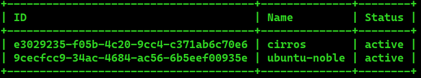
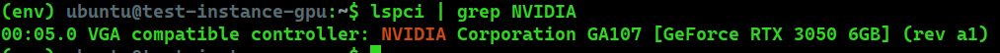
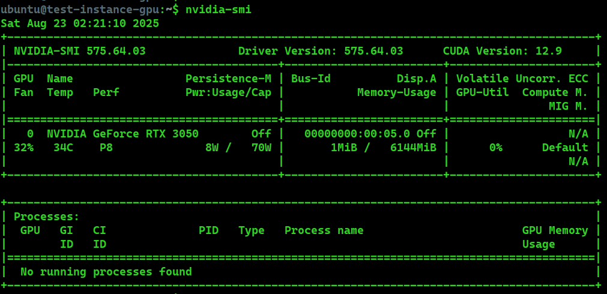

# Preparation
### To pass a GPU through to virtual machines, you will want to enable VT-d extensions in the BIOS. Next, update the grub configuration at /etc/default/grub to ensure IOMMU support is enabled.

```bash
$ sudo nano /etc/default/grub
...
GRUB_CMDLINE_LINUX_DEFAULT="intel_iommu=on"
...
```
### Refresh the grub configuration and reboot the server.
```bash
$ sudo update-grub
$ reboot
```
### Once the host has been rebooted, the next step in preparing the GPU for passthrough is to ensure the proper drivers are configured. Run lspci command to get PCI bus ID, vendor ID and product ID.

```
sudo lspci -nn | grep NVIDIA
01:00.0 VGA compatible controller [0300]: NVIDIA Corporation GA107 [GeForce RTX 3050 6GB] [10de:2584] (rev a1)
01:00.1 Audio device [0403]: NVIDIA Corporation Device [10de:2291] (rev a1)

```

### In this example, the PCI bus ID is 01:00.1, the vendor ID is 10de and the product ID is 2584.

# Blacklist

```
sudo nano /etc/modprobe.d/blacklist-nvidia.conf
```

### Add the following content 
```
blacklist nouveau
blacklist nvidiafb
```

# Whitelist
### Next, we need to ensure that the vfio-pci driver gets loaded and binds the GPU.

```
sudo nano /etc/modprobe.d/vfio.conf
```
### Add the following content 
```
options vfio-pci ids=10de:2584,10de:2291
```
### Then, add the vfio-pci driver to the /etc/modules-load.d/modules.conf file to ensure it’s loaded:
```
...
vfio-pci
```

### Now, edit once again the grub config file.

```
$ sudo nano /etc/default/grub
...
GRUB_CMDLINE_LINUX_DEFAULT="intel_iommu=on vfio-pci.ids=10de:2584,10de:2291 vfio_iommu_type1.allow_unsafe_interrupts=1 modprobe.blacklist=nvidiafb,nouveau"
...
```

### Refresh the grub configuration and reboot the server.
```
$ sudo update-grub
$ sudo reboot
```

# Nova changes
## This guild refers to openstack kolla installation.
### First, configure PCI passthrough whitelist on the compute node.
```
sudo nano /etc/kolla/nova-compute/nova.conf
```
### Add the following content
```
[pci]
passthrough_whitelist: { "vendor_id": "10de", "product_id": "2584" }
```

### Restart the nova compute service
```
$ sudo docker restart nova_compute
```

### Next, configure nova.conf on the node API service.
```
sudo nano /etc/kolla/nova-api/nova.conf
```
### The configuration should be like the following:

```
[pci]
alias: { "vendor_id":"10de", "product_id":"2584", "device_type":"type-PCI", "name":"geforce-gtx" }
[filter_scheduler]
enabled_filters = PciPassthroughFilter
available_filters = nova.scheduler.filters.all_filters
```

### Restart the nova api service
```
sudo docker restart nova_api
```
### Lastly, ensure that the Nova scheduler has been configured with a PCI Passthrough filter.

```
sudo nano /etc/kolla/nova-scheduler/nova.conf
```

### The configuration should be like the following:

```
[filter_scheduler]
enabled_filters = PciPassthroughFilter
available_filters = nova.scheduler.filters.all_filters
```

### Restart the nova scheduler service:
```
$ sudo docker restart nova_scheduler
```
# Create a flavor
### Create a flavor with the following command:
```
openstack flavor create \
--vcpus 8 \
--ram 16384 \
--disk 100 \
--property "pci_passthrough:alias"="geforce-gtx:1" \
8_16384_100_gpu
```
### The pci_passthrough:alias property referencing the geforce-gtx alias we configured earlier. The number 1 instructs nova that a single GPU should be assigned.

# Configure image
### The image that will be used, should have hidden the hypervisor id, since NVIDIA drivers do not work in instances with KVM hypervisor signatures.


```
$ openstack image list
```
### 



###

```
openstack image set 9cecfcc9-34ac-4684-ac56-6b5eef00935e --property img_hide_hypervisor_id=true
```

# Create an Instance
```
openstack server create \
--flavor 8_16384_100_gpu \
--image ubuntu-noble \
--network demo-net \
--key-name mykey \
test-instance-gpu
```

### Login to the instance and verify the GPU is recognized:

```
(env) ubuntu@test-instance-gpu:~$ lspci | grep NVIDIA
00:05.0 VGA compatible controller: NVIDIA Corporation GA107 [GeForce RTX 3050 6GB] (rev a1)

```
###

### 
```
ubuntu@test-instance-gpu:~$ ubuntu-drivers devices
udevadm hwdb is deprecated. Use systemd-hwdb instead.
udevadm hwdb is deprecated. Use systemd-hwdb instead.
udevadm hwdb is deprecated. Use systemd-hwdb instead.
udevadm hwdb is deprecated. Use systemd-hwdb instead.
udevadm hwdb is deprecated. Use systemd-hwdb instead.
udevadm hwdb is deprecated. Use systemd-hwdb instead.
udevadm hwdb is deprecated. Use systemd-hwdb instead.
udevadm hwdb is deprecated. Use systemd-hwdb instead.
udevadm hwdb is deprecated. Use systemd-hwdb instead.
udevadm hwdb is deprecated. Use systemd-hwdb instead.
udevadm hwdb is deprecated. Use systemd-hwdb instead.
udevadm hwdb is deprecated. Use systemd-hwdb instead.
udevadm hwdb is deprecated. Use systemd-hwdb instead.
udevadm hwdb is deprecated. Use systemd-hwdb instead.
ERROR:root:aplay command not found
== /sys/devices/pci0000:00/0000:00:05.0 ==
modalias : pci:v000010DEd00002584sv00001462sd00008121bc03sc00i00
vendor   : NVIDIA Corporation
model    : GA107 [GeForce RTX 3050 6GB]
driver   : nvidia-driver-575-server-open - distro non-free
driver   : nvidia-driver-575-open - distro non-free recommended
driver   : nvidia-driver-535 - distro non-free
driver   : nvidia-driver-535-open - distro non-free
driver   : nvidia-driver-535-server - distro non-free
driver   : nvidia-driver-550-open - distro non-free
driver   : nvidia-driver-570 - distro non-free
driver   : nvidia-driver-570-server-open - distro non-free
driver   : nvidia-driver-550 - distro non-free
driver   : nvidia-driver-575-server - distro non-free
driver   : nvidia-driver-535-server-open - distro non-free
driver   : nvidia-driver-575 - distro non-free
driver   : nvidia-driver-570-open - distro non-free
driver   : nvidia-driver-570-server - distro non-free
driver   : xserver-xorg-video-nouveau - distro free builtin

ubuntu@test-instance-gpu:~$ sudo apt install nvidia-driver-575-open

```

###


###
```
ubuntu@test-instance:~$  sudo reboot
```

### After rebooting the instance, verify the new drivers have been installed and work correctly by typing nvidia-smi:

###



